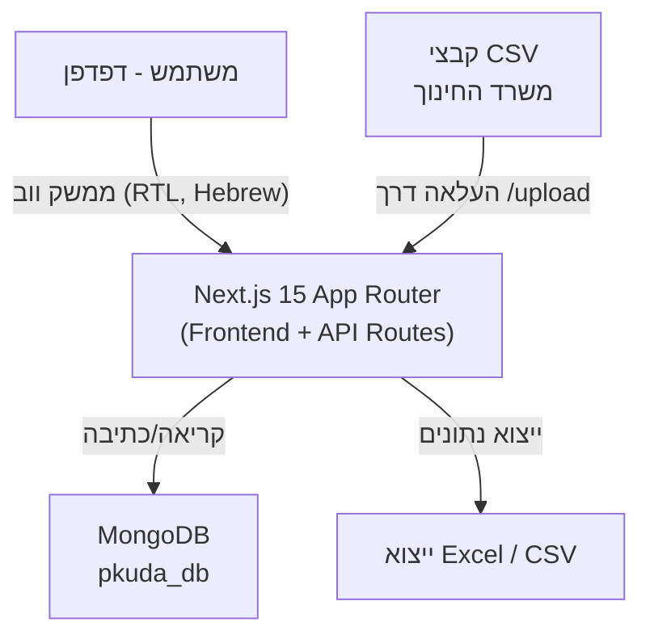
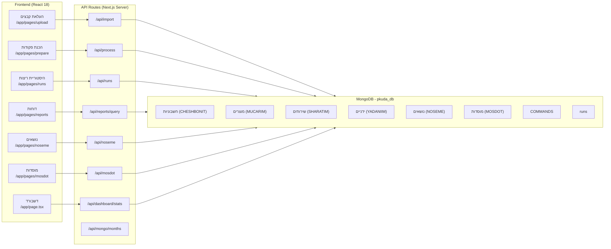
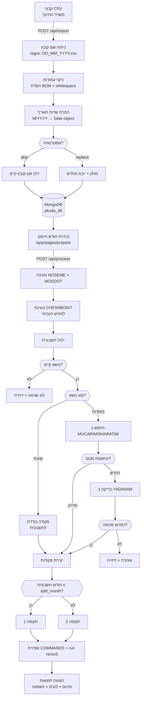

# pkuda_system – תיעוד מקיף של הפרויקט

---

## 1. סקירת הפרויקט

### מה המערכת עושה (במונחים עסקיים)

מערכת **pkuda_system** (`maetar2`) היא אפליקציית ניהול פקודות תשלום עבור **עיריית נתיבות, מחלקת חינוך**.
המערכת מקבלת קבצי CSV הכוללים חשבוניות ונתוני תשלום, מעבדת אותם על פי כללים עסקיים מוגדרים, ומייצרת **פקודות תשלום** מסודרות לשתי תקופות תשלום.

### הבעיה שהמערכת פותרת

מחלקת חינוך מקבלת מידע ממקורות שונים (חשבוניות, תוצרי ייצור, שירותים, ידניים) ונדרשת לאחד את הנתונים, לבדוק התאמות, ולהפיק פקודות תשלום מובנות בצורה עקבית וניתנת לביקורת. התהליך הידני היה מועד לשגיאות; המערכת ממכנת ומאמתת אותו.

### מי משתמש במערכת ואיך

- **עובדי מחלקת חינוך בעיריית נתיבות** — מנהלים פיננסיים ואחראי תשלומים
- **תהליך השימוש**:
  1. מעלים קבצי CSV (ייצוא ממשרד החינוך ומקורות אחרים) דרך ממשק הייבוא
  2. מגדירים נושאי תשלום (נושאים) ומוסדות
  3. מריצים עיבוד לחישוב פקודות לחודש נתון
  4. בודקים לוגים, סטיות, ושגיאות
  5. מייצאים לדוחות ול-CSV לצורך עבודה חיצונית

---

## 2. ארכיטקטורה

### דיאגרמת ארכיטקטורה כוללת



### דיאגרמת רכיבים מפורטת



### מחסנית טכנולוגית

| רכיב | טכנולוגיה | גרסה |
|------|-----------|-------|
| Framework | Next.js (App Router) | 15.1.0 |
| UI Library | React | 18.3.1 |
| Language | TypeScript | ^5 |
| Styling | Tailwind CSS | ^3.4.17 |
| Data Grid | AG-Grid Community | ^33.0.0 |
| Database | MongoDB | ^6.12.0 |
| CSV Parsing | csv-parser | ^3.0.0 |
| Excel | xlsx | ^0.18.5 |
| Runtime | Node.js | [requires clarification] |

### שירותים חיצוניים

- **MongoDB** — מסד הנתונים הראשי (מקומי או Atlas)
- אין שילובים עם API חיצוניים נוספים

---

## 3. מבנה הפרויקט

```
maetar2/
├── app/                          # ליבת האפליקציה (Next.js App Router)
│   ├── layout.tsx                # Layout שורש עם הגדרות RTL/Hebrew
│   ├── page.tsx                  # דף דשבורד ראשי
│   ├── globals.css               # סגנונות גלובליים + Tailwind directives
│   ├── api/                      # API Routes של Next.js (server-side)
│   │   ├── dashboard/
│   │   │   └── stats/route.ts    # סטטוס חיבור DB וספירת documents
│   │   ├── debug/route.ts        # endpoint לפיתוח — דגימת מסמכים
│   │   ├── import/route.ts       # ייבוא קבצי CSV עם ניתוח ואימות
│   │   ├── mongo/
│   │   │   └── months/route.ts   # חודשי חישוב ייחודיים מ-CHESHBONIT
│   │   ├── noseme/route.ts       # CRUD לנושאי תשלום
│   │   ├── mosdot/route.ts       # CRUD למוסדות
│   │   ├── process/route.ts      # מנוע עיבוד פקודות תשלום (ליבה)
│   │   └── reports/
│   │       ├── query/route.ts    # שאילתות דוחות עם פילטרים
│   │       └── topics/route.ts   # רשימת נושאים לסינון בדוחות
│   ├── components/               # רכיבי React משותפים
│   │   ├── ClientLayout.tsx      # Wrapper עם ניהול מצב Sidebar
│   │   ├── Sidebar.tsx           # ניווט צד עם סטטוס MongoDB
│   │   ├── ImportInfoButton.tsx  # כפתור עזרה עם tooltip שדות ייבוא
│   │   └── exportCsv.ts          # פונקציית עזר לייצוא CSV
│   └── pages/                    # דפי האפליקציה
│       ├── upload/page.tsx       # העלאת קבצי CSV עם בחירת תיקייה
│       ├── prepare/page.tsx      # ממשק הפקת פקודות תשלום
│       ├── runs/page.tsx         # היסטוריית עיבודים
│       ├── reports/page.tsx      # ממשק דוחות ושאילתות
│       ├── noseme/page.tsx       # ניהול נושאי תשלום
│       └── mosdot/page.tsx       # ניהול מוסדות
├── lib/
│   └── mongo.ts                  # ניהול connection pool ל-MongoDB
├── config.ts                     # שמות קולקציות MongoDB
├── package.json                  # תלויות npm
├── tsconfig.json                 # הגדרות TypeScript
├── tailwind.config.ts            # הגדרות Tailwind CSS
├── postcss.config.js             # הגדרות PostCSS
├── next.config.ts                # הגדרות Next.js (מגבלת 50MB לפעולות שרת)
├── next-env.d.ts                 # הגדרות TypeScript של Next.js
└── מבנה_DB.md                   # תיעוד מבנה מסד הנתונים (בעברית)
```

---

## 4. תיעוד מודולים

### `lib/mongo.ts` — ניהול חיבור MongoDB

**מטרה**: ניהול connection pool יחיד ל-MongoDB בצד השרת, למניעת פתיחת חיבורים מרובים.

**קלטים**: משתני סביבה `MONGODB_URI`, `MONGODB_DB`

**פלטים**: אובייקט `Db` של MongoDB

**פונקציות מרכזיות**:

| פונקציה | תיאור |
|---------|-------|
| `getDb(): Promise<Db>` | מחזירה את ה-DB instance, יוצרת חיבור חדש רק אם אין קיים |

**תלויות**: `mongodb`

---

### `config.ts` — הגדרות קולקציות

**מטרה**: מפה מרכזית של שמות קולקציות MongoDB — מונעת strings קשיחים פזורים בקוד.

**פלטים**: `CONFIG.collections` — אובייקט עם שמות כל הקולקציות

```typescript
export const CONFIG = {
  collections: {
    CHESHBONIT: 'חשבוניות',
    MUCARIM: 'מוצרים',
    SHARATIM: 'שירותים',
    YADANIIM: 'ידניים',
    GY: 'גן ילדים',
    HASAOT: 'הסעות',
    HASNET: 'השנת',
    HASMASLULIM: 'המסלולים',
    MISROT: 'משרות',
    MISROTGY: "משרות ג'י",
    MOADON: 'מועדון',
    MUTAVIM: 'מוטבים',
    SHEFI: 'שפי',
    NOSEME: 'נושאים',
    MOSDOT: 'מוסדות',
    RUNS: 'runs',
    COMMANDS: 'COMMANDS',
    RUN_LOGS: 'run_logs',
    RUN_RESULTS: 'run_results',
    RUN_HASHVHA: 'run_hashvha',
  }
};
```

---

### `app/api/import/route.ts` — ייבוא קבצי CSV

**מטרה**: קבלת קבצי CSV, ניתוחם, ושמירתם לקולקציות המתאימות ב-MongoDB.

**קלטים** (POST, FormData):
- `strategy`: `"skip"` (ברירת מחדל) או `"replace"` — אסטרטגיית טיפול בקבצים קיימים
- `files[]`: קובץ CSV אחד או יותר

**פלטים**:
```json
{
  "ok": true,
  "runId": "RUN_<timestamp>",
  "summary": [
    { "file": "filename.csv", "status": "imported"|"skipped"|"replaced"|"error", "count": 42 }
  ]
}
```

**לוגיקה עסקית**:
- שם קובץ חייב להתאים ל-regex: `(\d+)_(\d{1,2})_(\d{4})([A-Z0-9]+).csv`
  - קבוצות: יום, חודש, שנה, שם_קולקציה
- ניקוי עמודות: הסרת BOM, רווחים
- שדות תאריך בפורמט `"M/YYYY"` מומרים לאובייקט `Date`
- כל document מקבל metadata: `source_file`, `import_timestamp`, `run_id`, `file_type`

**פונקציות מרכזיות**:

| פונקציה | תיאור |
|---------|-------|
| `POST(req)` | Handler ראשי — מפרסר FormData ומעבד כל קובץ |
| `parseDate(val)` | ממיר string "M/YYYY" לאובייקט Date |
| `normalizeColumns(row)` | מנקה שמות עמודות (BOM, whitespace) |

**תלויות**: `csv-parser`, `lib/mongo`, `config`

---

### `app/api/process/route.ts` — מנוע עיבוד פקודות תשלום

**מטרה**: הליבה העסקית של המערכת. מקבל חודש חישוב, קורא נתונים מ-MongoDB, ומפיק פקודות תשלום מאומתות.

**קלטים** (POST, JSON):
```json
{
  "calc_month": "YYYY-MM",
  "split_month": "YYYY-MM",
  "value_date": "YYYY-MM-DD"
}
```

**פלטים**:
```json
{
  "ok": true,
  "runId": "RUN_<timestamp>",
  "tabs": {
    "summary": { "total": 0, "totalAmount": 0, "totalIncome": 0, "totalExpense": 0 },
    "period1": [ "CommandEntry[]" ],
    "period2": [ "CommandEntry[]" ],
    "logs": [ { "type": "error|warning|info", "קוד_נושא": "...", "message": "..." } ],
    "comparison": [ { "קוד_נושא": "...", "invoiceTotal": 0, "baseTotal": 0, "yadaniTotal": 0 } ],
    "rejected": [ { "קוד_נושא": "...", "reason": "..." } ]
  }
}
```

**תהליך העיבוד** (ראה סעיף 5 לפרוט):
1. טעינת נושאים ומוסדות
2. טעינת חשבוניות לחודש הנבחר
3. עבור כל חשבונית: בדיקת נושא, התאמה לנתוני בסיס, טיפול בהפרשים
4. הפקת פקודות לשתי תקופות
5. בניית טבלת השוואה
6. שמירת run record ב-MongoDB

**פונקציות מרכזיות**:

| פונקציה | תיאור |
|---------|-------|
| `POST(req)` | Handler ראשי של מנוע העיבוד |
| `buildSummaryRow(entries, label)` | יוצר שורת סיכום לתקופה |
| `formatMonth(date)` | מעצב תאריך לפורמט "MM/YYYY" |

**תלויות**: `lib/mongo`, `config`

---

### `app/api/noseme/route.ts` — ניהול נושאי תשלום

**מטרה**: CRUD API לקולקציית הנושאים (נושאים).

**פעולות**:
- `GET` → `{ noseme: NosemeRecord[] }` — כל הנושאים
- `POST` (body: `NosemeRecord`) → upsert לפי `code`
- `DELETE` (`?code=<code>`) → מחיקה לפי קוד

**שדות `NosemeRecord`**: `code`, `name`, `table_type`, `direction`, `seif`, `mosad_col_name`

---

### `app/api/mosdot/route.ts` — ניהול מוסדות

**מטרה**: CRUD API לקולקציית המוסדות.

**פעולות**:
- `GET` → `{ mosdot: MosadRecord[] }` — כל המוסדות
- `POST` (body: `MosadRecord`) → upsert לפי `code`
- `DELETE` (`?code=<code>`) → מחיקה לפי קוד

**שדות `MosadRecord`**: `code`, `name`, `nihul_atsmi`, `hazana`, `krav`, `sachar`

---

### `app/api/reports/query/route.ts` — שאילתות דוחות

**מטרה**: שאילתת מספר קולקציות במקביל עם פילטרים גמישים.

**קלטים** (POST, JSON):
```json
{
  "collections": ["חשבוניות", "מוצרים"],
  "nose_codes": ["001", "002"],
  "from_month": "YYYY-MM",
  "to_month": "YYYY-MM",
  "calc_month": "YYYY-MM",
  "limit": 1000
}
```

**פלטים**: `{ results: { [collectionName]: rows[] } }`

**הערות**: מסנן שורות עם `הפרש_מחושב === 0` בקולקציות MUCARIM ו-SHARATIM.

---

### `app/api/dashboard/stats/route.ts` — סטטיסטיקות דשבורד

**מטרה**: בדיקת חיבור DB וספירת documents בכל קולקציה.

**פלטים**:
```json
{
  "connected": true,
  "commandsCount": 0,
  "runsCount": 0,
  "errorRunsCount": 0,
  "collections": [ { "name": "חשבוניות", "count": 0 } ]
}
```

---

### `app/components/Sidebar.tsx` — ניווט צדי

**מטרה**: תפריט ניווט קבוע עם 7 פריטים וסטטוס חיבור MongoDB.

**פריטי ניווט**: דשבורד, העלאת קבצים, הכנת פקודות, היסטוריית ריצות, דוחות, נושאים, מוסדות

**תכונות**: הדגשת נתיב פעיל, אינדיקטור ירוק/אדום/צהוב לסטטוס DB.

---

### `app/components/exportCsv.ts` — ייצוא CSV

**מטרה**: ייצוא נתוני טבלה ל-CSV עם תמיכה בעברית.

**פונקציות**:

| פונקציה | תיאור |
|---------|-------|
| `exportToCsv(filename, columns, rows)` | מייצר קובץ CSV ומוריד אותו לדפדפן |

**הערה**: מוסיף UTF-8 BOM (`\uFEFF`) לתמיכה בעברית ב-Excel.

---

### `app/components/ImportInfoButton.tsx` — כפתור מידע ייבוא

**מטרה**: הצגת tooltip עם רשימת שדות נדרשים לייבוא CSV.

---

### `app/pages/upload/page.tsx` — דף העלאת קבצים

**מטרה**: ממשק לבחירת תיקייה והעלאת קבצי CSV לייבוא.

**תכונות**:
- בחירת תיקייה שלמה (`webkitdirectory`)
- תצוגה מקדימה של קבצים וגדלים
- אסטרטגיות ייבוא: "דלג" / "החלף"
- טבלת תוצאות עם AG-Grid
- תקצירי ייבוא: יובאו/דולגו/הוחלפו/שגיאות

---

### `app/pages/prepare/page.tsx` — דף הכנת פקודות

**מטרה**: ממשק לבחירת חודש חישוב והפעלת מנוע העיבוד.

**שלבים**:
1. **קלט**: בחירת חודש חישוב (מה-DB), חודש פיצול, תאריך ערך
2. **תוצאות**: טאבים — סיכום, תקופה 1, תקופה 2, לוגים, השוואה, דחויים

---

### `app/pages/reports/page.tsx` — דף דוחות

**מטרה**: ממשק שאילתות גמיש על מספר קולקציות.

**תכונות**:
- פילטר נושאים רב-ברירה עם חיפוש
- טווח תאריכים: from_month / to_month
- בחירת קולקציות נוספות
- ניהול נראות עמודות
- ייצוא CSV ו-Excel
- מגבלה: 2000 שורות לקולקציה

---

## 5. זרימת נתונים

### תיאור שלב-אחר-שלב

**שלב 1 — ייבוא נתונים**:
קבצי CSV מקבלים שמות בפורמט `DD_MM_YYYY<COLLECTION>.csv` (לדוגמה: `01_03_2024CHESHBONIT.csv`), מועלים דרך ממשק ה-Upload, ונשמרים לקולקציות המתאימות ב-MongoDB.

**שלב 2 — הגדרת נושאים ומוסדות**:
המשתמש מגדיר נושאי תשלום (NOSEME) ומוסדות (MOSDOT) דרך ממשקי הניהול, או מייבא אותם מ-Excel.

**שלב 3 — הפקת פקודות**:
המשתמש בוחר חודש חישוב → המערכת קוראת את הנתונים הרלוונטיים, מעבדת אותם, ומפיקה פקודות תשלום.

**שלב 4 — בדיקה ואישור**:
המשתמש בוחן את הלוגים, ההשוואות, והדחויים → מתקן נתונים אם נדרש → מריץ מחדש.

**שלב 5 — ייצוא**:
ייצוא תוצאות ל-CSV/Excel לצורך עבודה עם מערכות חיצוניות.

### דיאגרמת זרימה



---

## 6. סכמת מסד הנתונים

### קולקציות קלט (נטענות מקבצי CSV)

#### `חשבוניות` (CHESHBONIT)
חשבוניות — קובץ מרכזי לעיבוד

| שדה | תיאור |
|-----|-------|
| `חודש_חישוב` | חודש החישוב (Date) — שדה מפתח לסינון |
| `קוד_נושא` | קוד נושא התשלום |
| `סכום` | סכום החשבונית |
| `source_file` | שם קובץ המקור |
| `import_timestamp` | זמן הייבוא |
| `run_id` | מזהה ריצת הייבוא |
| `file_type` | סוג הקובץ |

#### `מוצרים` (MUCARIM)
נתוני ייצור/תוצרים — מקור נתוני בסיס למוסדות

#### `שירותים` (SHARATIM)
נתוני שירותים — מקור נתוני בסיס למוסדות

#### `ידניים` (YADANIIM)
הזנות ידניות — לכיסוי הפרשים שאינם מוסברים

#### `גן ילדים` (GY)
נתוני גני ילדים

#### `הסעות` (HASAOT)
נתוני הסעות

#### `השנת` (HASNET)
נתוני שכר [requires clarification]

#### `המסלולים` (HASMASLULIM)
נתוני מסלולים

#### `משרות` (MISROT)
נתוני משרות

#### `משרות ג'י` (MISROTGY)
נתוני משרות גן ילדים

#### `מועדון` (MOADON)
נתוני מועדון

#### `מוטבים` (MUTAVIM)
נתוני מוטבים

#### `שפי` (SHEFI)
[requires clarification]

---

### קולקציות הגדרות (מנוהלות ע"י המשתמש)

#### `נושאים` (NOSEME)
נושאי תשלום — הגדרת קטגוריות עיבוד

| שדה | סוג | תיאור |
|-----|-----|-------|
| `code` | string | קוד ייחודי של הנושא |
| `name` | string | שם הנושא |
| `table_type` | string | סוג טבלה: `"שונות"` \| `"מוסדות"` |
| `direction` | string | כיוון: חובה/זכות |
| `seif` | string | סעיף חשבונאי |
| `mosad_col_name` | string | שם עמודה במוסדות |

**אינדקס**: upsert לפי `code`

#### `מוסדות` (MOSDOT)
מוסדות חינוך

| שדה | סוג | תיאור |
|-----|-----|-------|
| `code` | string | קוד ייחודי של המוסד |
| `name` | string | שם המוסד |
| `nihul_atsmi` | string | ניהול עצמי |
| `hazana` | string | הזנה |
| `krav` | string | קרב |
| `sachar` | string | שכר |

**אינדקס**: upsert לפי `code`

---

### קולקציות פלט (נוצרות ע"י המערכת)

#### `COMMANDS`
פקודות התשלום המחושבות

| שדה | תיאור |
|-----|-------|
| `run_id` | מזהה ריצת העיבוד |
| `קוד_נושא` | קוד הנושא |
| `seif_hova` | סעיף חובה |
| `seif_zhut` | סעיף זכות |
| `period` | תקופה (1 או 2) |
| `סכום` | סכום הפקודה |
| `value_date` | תאריך ערך |
| `calc_month` | חודש חישוב |
| `split_month` | חודש פיצול |

#### `runs`
היסטוריית ריצות עיבוד

| שדה | תיאור |
|-----|-------|
| `run_id` | מזהה ייחודי: `RUN_<timestamp>` |
| `calc_month` | חודש חישוב |
| `split_month` | חודש פיצול |
| `status` | סטטוס הריצה |
| `started_at` | זמן התחלה |
| `completed_at` | זמן סיום |
| `commandsCount` | מספר פקודות שנוצרו |
| `errorsCount` | מספר שגיאות |
| `warningsCount` | מספר אזהרות |

#### `run_logs`
לוגים מפורטים של כל ריצה

#### `run_results`
תוצאות מפורטות של כל ריצה

#### `run_hashvha`
טבלת השוואה: חשבונית מול בסיס מול ידני

---

## 7. הגדרות וסביבה

### משתני סביבה נדרשים

| שם משתנה | תיאור |
|----------|-------|
| `MONGODB_URI` | מחרוזת חיבור ל-MongoDB |
| `MONGODB_DB` | שם מסד הנתונים (ברירת מחדל: `pkuda_db`) |

**קובץ**: `.env.local` (לא מועלה ל-Git)

### שירותים חיצוניים הדורשים credentials

- **MongoDB** — מקומי או MongoDB Atlas

---

## 8. הוראות הפעלה

### דרישות מוקדמות

- Node.js (גרסה מומלצת: LTS) [requires clarification — גרסה מדויקת לא צוינה]
- MongoDB מקומי או Atlas
- npm

### התקנה

```bash
# שיבוט הפרויקט
git clone <repo-url>
cd maetar2

# התקנת תלויות
npm install

# יצירת קובץ משתני סביבה
cp .env.local.example .env.local
# עריכת .env.local עם נתוני MongoDB
```

### הגדרת `.env.local`

```env
MONGODB_URI=mongodb://localhost:27017
MONGODB_DB=pkuda_db
```

### הפעלה

```bash
# מצב פיתוח
npm run dev
# האפליקציה תפתח בכתובת http://localhost:3000

# בניה לייצור
npm run build

# הפעלת גרסת ייצור
npm run start
```

### הגבלות ידועות בהגדרה

- `next.config.ts` מגדיר מגבלת body של 50MB לפעולות שרת — נדרש להעלאת קבצים גדולים

---

## 9. בעיות ידועות / TODO

### TODOs שנמצאו בקוד

לא נמצאו תגיות `TODO` או `FIXME` מפורשות בקוד המקור.

### מגבלות ידועות

1. **מגבלת שורות בדוחות**: 2000 שורות לקולקציה ב-`/api/reports/query` — אין pagination מלא
2. **אין authentication**: המערכת אינה כוללת מנגנון כניסה/הרשאות — [requires clarification — האם יש תוכנית לזה?]
3. **קולקציות חלקיות**: קולקציות `GY`, `HASAOT`, `HASNET`, `HASMASLULIM`, `MISROT`, `MISROTGY`, `MOADON`, `MUTAVIM`, `SHEFI` מוגדרות ב-`config.ts` אך לא נעשה בהן שימוש מפורש במנוע העיבוד הראשי (`/api/process`) — [requires clarification]
4. **אין בדיקות אוטומטיות**: לא נמצאו קבצי test
5. **ייצוא Excel**: ייצוא ל-Excel מוגדר בממשק הדוחות אך מימוש מלא [requires clarification]
6. **שם קולקציה `SHEFI`**: תוכן ומטרת הקולקציה לא ברורים מהקוד

---

## 10. הערות פיתוח

### קונוונציות קוד

- **שפה**: TypeScript לכל הקוד; שמות שדות ב-MongoDB בעברית
- **RTL**: כל ה-HTML עם `dir="rtl"` ו-`lang="he"`
- **Tailwind**: סגנון utility-first; צבעי מותג: `#0969da` (כחול), `#f6f8fa` (רקע)
- **AG-Grid**: שימוש ב-Community edition לכל טבלאות הנתונים
- **Server Components**: ברירת המחדל; דפי ממשק הם `'use client'`

### מבנה API Routes

כל API routes הם Next.js Route Handlers:
- ממוקמים ב-`app/api/**`
- יוצאים פונקציות: `GET`, `POST`, `DELETE`
- מחזירים `Response` או `NextResponse`

### שמות שדות בעברית

שדות MongoDB שמות בעברית — זהו כוונה מעצבית כדי להתאים לשמות השדות בקבצי המקור:

```
קוד_נושא    — קוד הנושא
חודש_חישוב  — חודש החישוב
סכום        — הסכום
הפרש_מחושב — הפרש מחושב
seif_hova   — סעיף חובה (בEng כי שם טכני)
seif_zhut   — סעיף זכות
```

### ניהול connection pool

`lib/mongo.ts` משתמש ב-`global._mongoClient` למניעת יצירת חיבורים חדשים בכל קריאת API ב-Next.js dev mode (hot reload).

### פורמט שמות קבצי ייבוא

פורמט קשיח לשמות קבצי CSV:
```
DD_MM_YYYY<COLLECTION_NAME>.csv
דוגמה: 01_03_2024CHESHBONIT.csv
```
שם הקולקציה (באנגלית) חייב להתאים לערך ב-`CONFIG.collections`.

### הפרדת תקופות

מנוע העיבוד מפצל פקודות לשתי תקופות לפי `split_month`:
- **תקופה 1**: חשבוניות ≤ split_month
- **תקופה 2**: חשבוניות > split_month

### עיבוד סוג נושא "מוסדות"

לנושאים מסוג `"מוסדות"`, המערכת מחפשת התאמת סכום בין החשבונית לנתוני הבסיס (MUCARIM/SHARATIM). אם יש הפרש, בודקת ב-YADANIIM. אם ההפרש עדיין לא מוסבר — הרשומה נדחית עם אזהרה.
